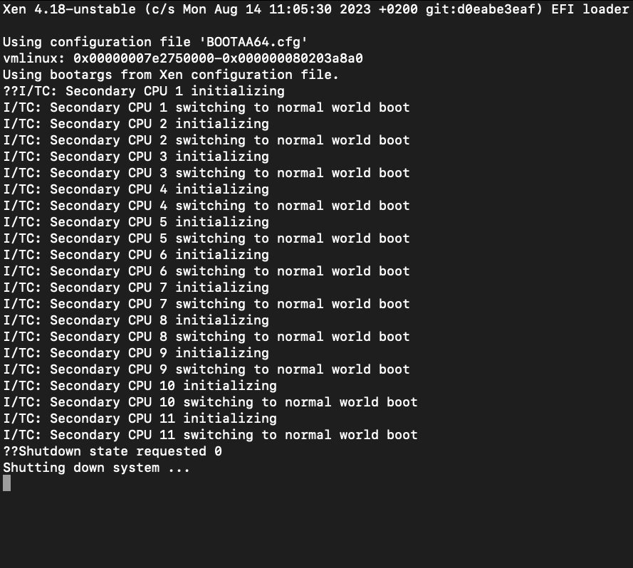
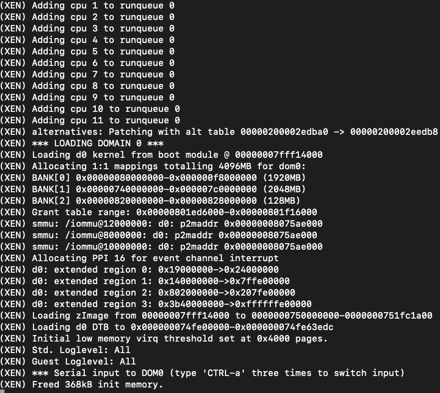
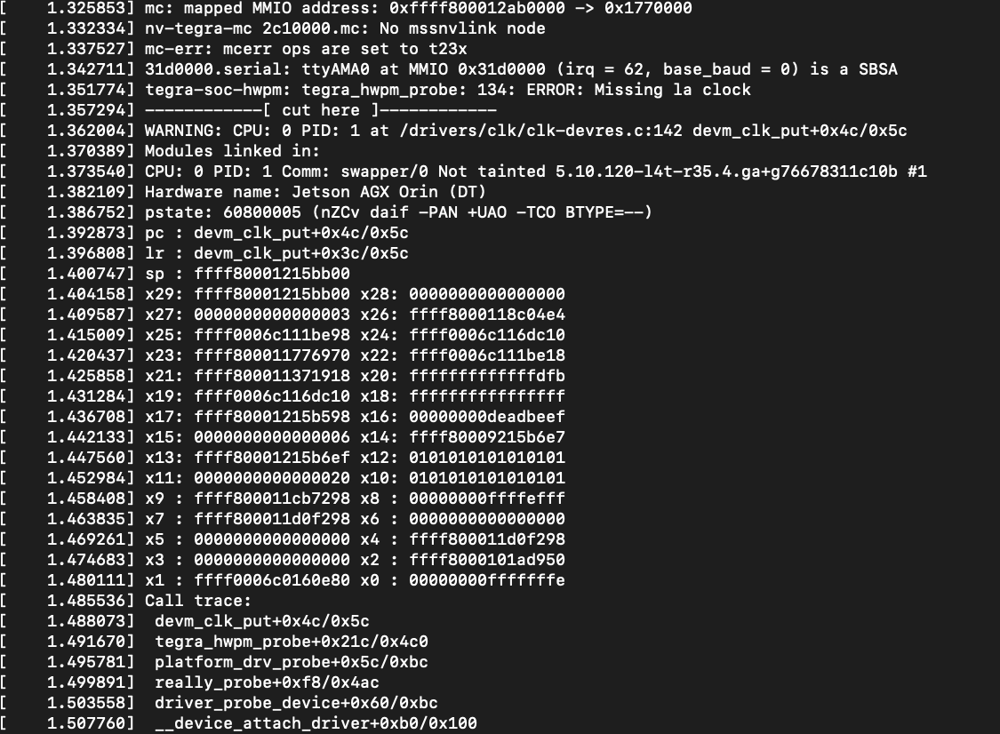
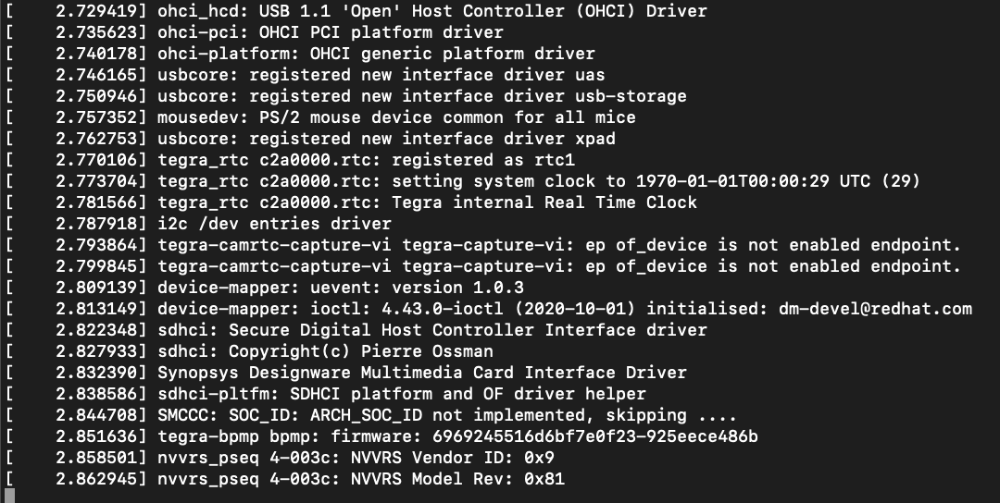
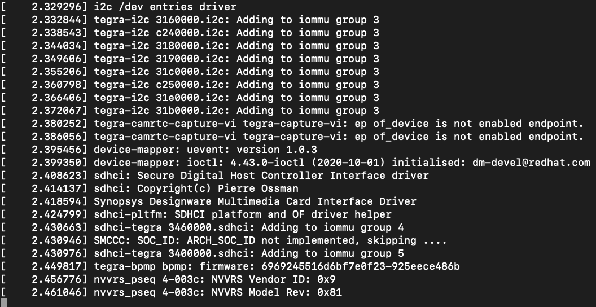
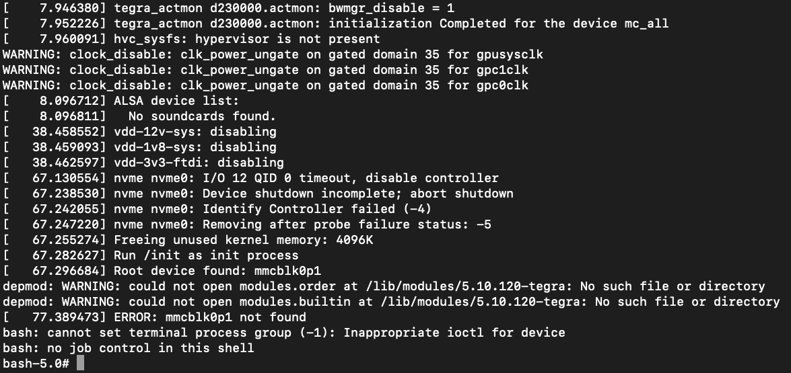

# Xen-on-Nvidia-Orin

 目标：同时在AGX Orin的cortex-A78AE内核上运行Xen和FreeRTOS
 
 Target: Run both Xen and FreeRTOS on AGX Orin's cortex-A78AE cores.

 硬件平台：Nvidia AGX Orin 32GB
 
 Hardware platform: Nvidia AGX Orin 32GB

 进度：25%
 
 Progress: 25%

 近况：卡在EMMC和NVME硬盘的识别问题上(20231206)

 Current status: Stucking on EMMC and NVME SSD identification issues(20231206)

第一步：未知位置反复重启。

First step: Board resets in unknown position repeatly. 

 

第二步：Xen正常启动，dom0已加载，内核未启动。

Second step: Xen boots normally, dom0 has been loaded, but kernel didn't startup. 

 

第三步：内核已启动，途中报错，开始慢慢排错。

Third step: Kernel has started and some errors showup. Dealing with that slowly.
 
 

第四步：继续向下走了1s多。

Fourth step: Go on for one more sec.

 

第五步：修复了前面的一些问题。

Fifth step: Fixed some previous issues. 

 

第六步：屏蔽了一些东西。

Sixth step: Turn off something.

 