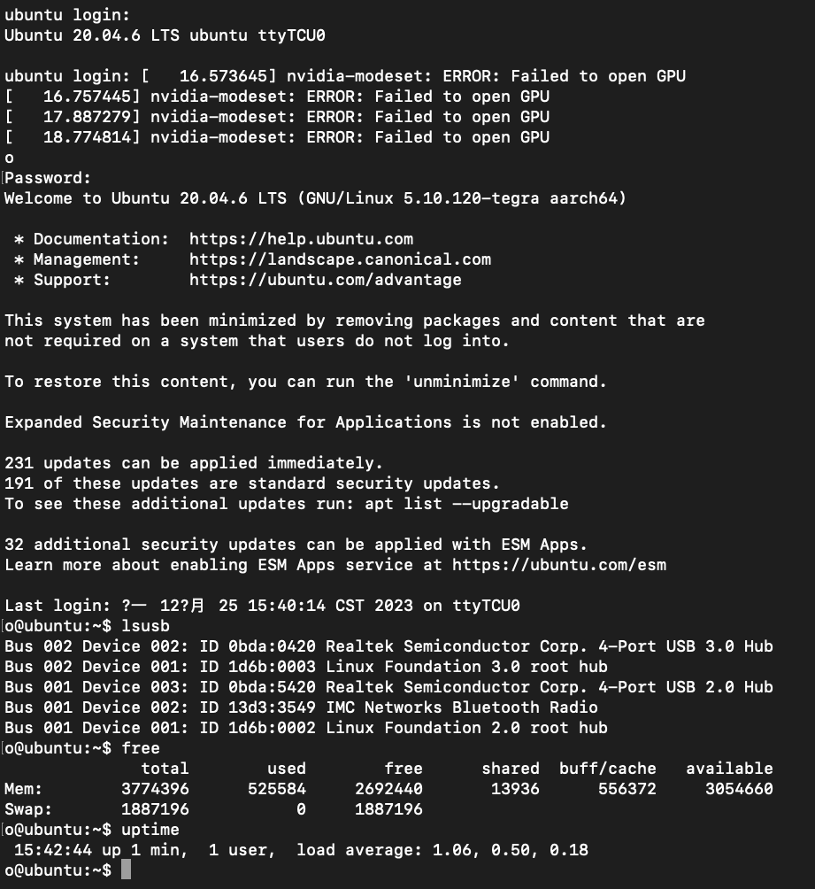
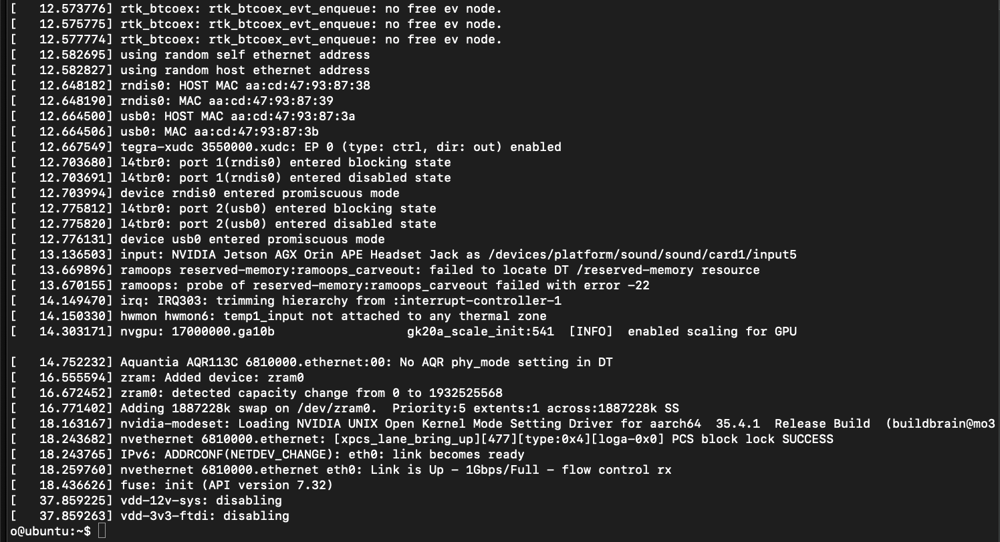
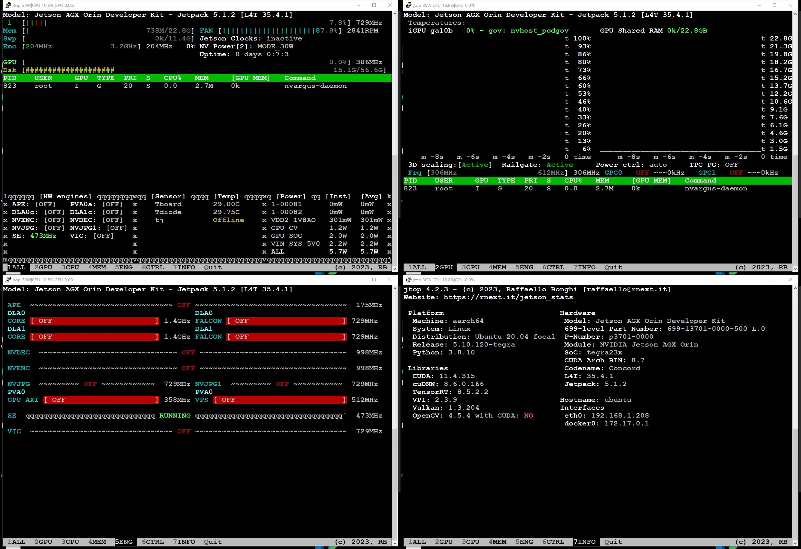
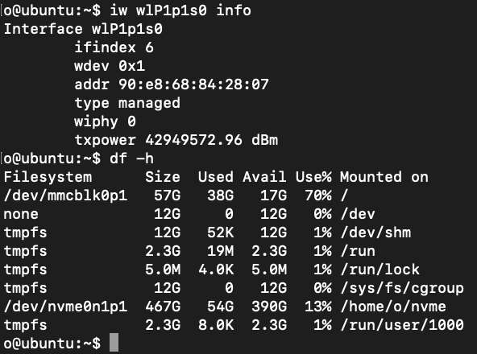
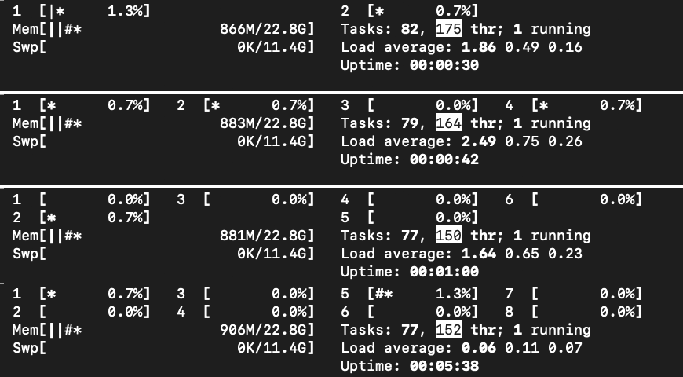
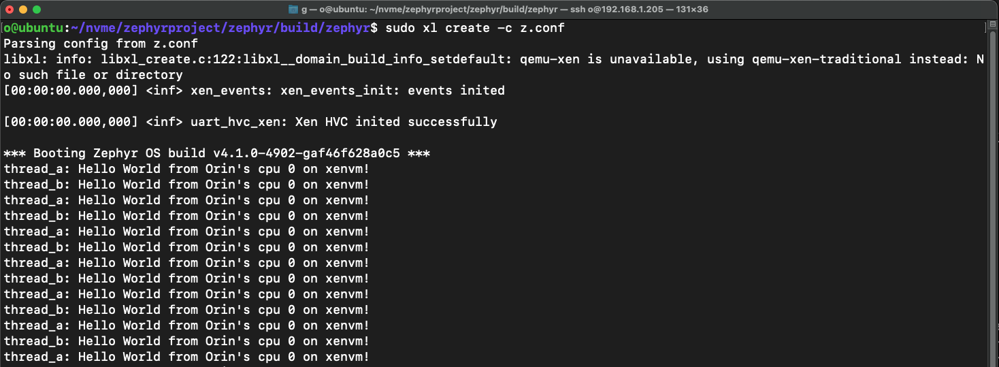

# Xen-on-Nvidia-Orin

 目标：同时在AGX Orin的cortex-A78AE内核上运行Xen和FreeRTOS（或threadX）
 
 Target: Run both Xen and FreeRTOS(or threadX) on AGX Orin's cortex-A78AE cores.

 硬件平台：Nvidia AGX Orin 32GB
 
 Hardware platform: Nvidia AGX Orin 32GB

 进度：80%
 
 Progress: 80%

 近况：实现了domU zephyr rtos周期任务的功能。继续解决threadX的vtimer问题。(20250529)

 Current status: The function of domU zephyr rtos periodic task is implemented. Keep working on vtimer issue of threadX.(20250529)

 测试：上传了可用于评估的demo。

 Test: Upload a demo for evaluating.

 问题列表：
 
 1、wdt、qspi启动报错

 ~~2、eth0初始化错误~~

 ~~3、thermal zone识别错误~~

 ~~4、nvidia-modeset无法打开GPU~~

 ~~5、设置dom0_max_vcpus为多核时，tegra-cache报错~~

 ~~6、pcie(包括nvme和wifi)报错~~

 ~~7、温度传感器缺失~~

 8、cpufreq未工作

 9、threadX的timer和interrupt未工作

 Isuses list:
 1. wdt and qspi report error when system is starting up.
 2. ~~eth0 initialization failed.~~
 3. ~~failed to build thermal zone.~~
 4. ~~GPU can't be opened.~~
 5. ~~tegra-cache will report error when I set xen's dom0_max_vcpus more than one. ~~
 6. ~~pcie(include nvme and wifi) reports error.~~
 7. ~~temperature sensors are not found~~
 8. cpufreq doesn't work
 9. timer and interrupt of threadX are not working

第一步：未知位置反复重启。

Step 1: Board resets in unknown position repeatly. 

 

第二步：Xen正常启动，dom0已加载，内核未启动。

Step 2: Xen boots normally, dom0 has been loaded, but kernel didn't startup. 

 

第三步：内核已启动，途中报错，开始慢慢排错。

Step 3: Kernel has started and some errors showup. Dealing with that slowly.
 
 

第四步：继续向下走了1s多。

Step 4: Go on for one more sec.

 

第五步：修复了前面的一些问题。

Step 5: Fixed some previous issues. 

 

第六步：屏蔽了一些东西。

Step 6: Turn off something.

 

第七步：终于识别了EMMC，并启动了Ubuntu。

Step 7: Finally found EMMC and started up Ubuntu.

 

第八步：系统工作正常，但还有一些问题。

Step 8: System works well, but there are some isuses.

 

第九步：解决了网卡问题，GPU也已经识别到。

Step 9: Fixed ethernet isuse. GPU could be found.

 

第十步：安装了Jetpack，并测试了mnistCUDNN和sample_cudla例程

Step 10: Installed Jetpack. Tested mnistCUDNN and sample_cudla demos.

 

第十一步：修复pcie问题，nvme ssd和wifi均正常。

Step 11: Fixed pcie issuse, nvme ssd and wifi are working.

 

第十二步：修复dom0_max_vcpus数量设置问题。

Step 12: Fixed dom0_max_vcpus number issue.

 

第十三步：配置好xen tools，编译了threadX的demo，看起来能够运行。

Step 13: Xen tools is working well. Compiled a threadX demo and it seems work.

 

第十四步：成功运行了domU的zephyr rtos，并实现了周期任务。

Step 14: Successfully run domU's zephyr rtos and the periodic task.

 